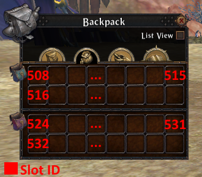
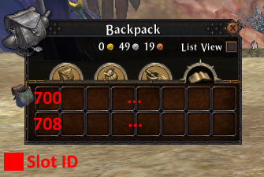

Bag Info
========

When a new character is created pouch 1 and 2 are unlocked.

Pouch 3 cost 1 gold (money = 0x2710).

Pouch 4 costs 5 gold (money = 0xc350).

Pouch 5 costs 15 gold (money = 0x249f0).

Pouch 1 and 2:

* GameData.Player.numBackpackSlots = 0x20
* GameData.Player.backpackExpansionSlots = 0x10
* GameData.Player.backpackExpansionSlotsCost = 0x2710

Pouch 3:

* GameData.Player.numBackpackSlots = 0x30
* GameData.Player.backpackExpansionSlots = 0x10
* GameData.Player.backpackExpansionSlotsCost = 0xc350

Pouch 4:

* GameData.Player.numBackpackSlots = 0x40
* GameData.Player.backpackExpansionSlots = 0x10
* GameData.Player.backpackExpansionSlotsCost = 0x249f0

Pouch 5:

* GameData.Player.numBackpackSlots = 0x50
* GameData.Player.backpackExpansionSlots = 0x00
* GameData.Player.backpackExpansionSlotsCost = 0x00

Bag Slot ID
-----------

Value of all :class:`slot_id` mapped on backpack window.

Inventory Items
"""""""""""""""

.. image:: images/backpack_inventory_items_slot_id.png

Currency Items
""""""""""""""

Crafting Items
""""""""""""""

.. image:: images/backpack_crafting_items_slot_id.png

Quest Items
"""""""""""

