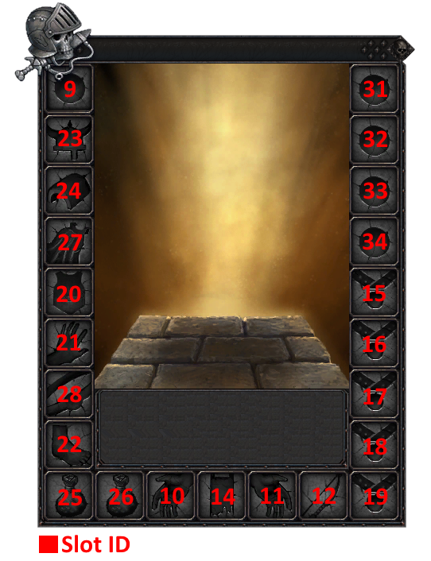

Items Data
==========

Values :class:`GameData.ItemTypes` found in :func:`sub 0x005B07A2`.

================================================== =================
TYPE                                               VALUE
================================================== =================
NONE                                               0
SWORD                                              1
AXE                                                2
HAMMER                                             3
SHIELD                                             5
ROBE                                               6
BOW                                                7
GUN                                                9
STAFF                                              11
DAGGER                                             12
SPEAR                                              14
PISTOL                                             15
LIGHTARMOR                                         18
MEDIUMARMOR                                        19
HEAVYARMOR                                         20
QUEST                                              21
MEDIUMROBE                                         22
ENHANCEMENT                                        23
TROPHY                                             24
CHARM                                              25
DYE                                                27
BASICMOUNT                                         29
ADVANCEDMOUNT                                      30
POTION                                             31
SALVAGING                                          32
MARKETING                                          33
CRAFTING                                           34
ACCESSORY                                          35
CURRENCY                                           36
TELEPORT                                           37
TELEPORT_GROUP                                     38
SIEGE                                              39
TREASURE_CHEST                                     40
TREASURE_KEY                                       41
REFINER_TOOL                                       45
================================================== =================

Values :class:`GameData.Item` found in :func:`sub 0x005B07A2`.

================================================== =================
EITEMFLAG                                          VALUE
================================================== =================
NO_CHARGE_DELETE                                   0
CAN_USE_IN_TRIAL                                   1
BIND_ON_PICKUP                                     2
BIND_ON_EQUIP                                      3
TEMPORARY                                          4
NO_MOVE                                            5
BROKEN                                             6
DECAYED                                            7
DYE_ABLE                                           8
MUNDANE_SALVAGABLE                                 10
MAGICAL_SALVAGABLE                                 9
NO_SELL                                            13
HIDE_ITEM_LEVEL                                    19
================================================== =================

Character Slot ID
-----------------

Value of all :class:`slot_id` mapped on character window.

Icons
-----

Big list of items with their ID, Icon ID, type and slot can be found in
:file:`data/gamedata/itemdata.csv` (0x2A87C15DF8425A8C) in :file:`data.myp`.

Icons images are stored in :file:`interface.myp` in `DirectDraw_Surface`_ format.

Association between ID and image file name are stored in :file:`interface/default/eatemplate_icons/source/icons.xml`
(0xBC8564953C316BF6) in :file:`interface.myp`.

================================================== =================
TYPE                                               ID ICON
================================================== =================
Misc Icons                                         0-99
Skill Icons                                        100-199
Item Icons                                         200-799
Greenskin Shield Textures                          1000-1199
Greenskin Weapon Icons                             1200-1499
Greenskin Armor Icons                              1500-2099
Greenskin Ability Icons                            2100-2999
Dwarf Shield Icons                                 3000-3199
Dwarf Weapon Icons                                 3200-3499
Dwarf Armor Icons                                  3500-4099
Dwarf Ability Icons                                4100-4999
Generic Ability Icons                              5000-5099
Chaos Ability Icons                                5100-5999
Chaos Armor Icons                                  6000-7599
Chaos Weapon Icons                                 7600-7899
Empire Ability Icons                               7900-8799
Empire Armor Icons                                 8800-10399
Empire Weapon Icons                                10400-10699
Empire Shield Icons                                10700-10899
Dark Elf Ability Icons                             10900-11199
Dark Elf Weapons Icons                             11200-11499
Dark Elf Shields Icons                             11500-11699
Dark Elf Armor Icons                               11700-13299
High Elf Ability Textures                          13300-13699
High Elf Weapons Icons                             13700-13999
High Elf Shields Icons                             14000-14199
High Elf Armor Icons                               14200-15799
NPC Weapon Icons                                   14500-14600
Illuminated Letters Icons                          20065-20179
Career Icons                                       20180-20214
Mount Icons                                        20215-20249
Crafting Icons                                     20250-22249
Renown Icons                                       22250-22649
Tactic Icons                                       22650-22999
Pregame Race Icons                                 23000-23049
ME Icons                                           23050-23099
Siege Icons                                        23100-23149
Archetype Icons                                    23150-23399
Siege Abilities Icons                              23400-23499
Event Icons                                        23500-23799
Sigil Icons                                        23800-24999
RVR Icons                                          25000-25099
TK Weapons                                         25100-26999
TK Inventory                                       27000-28199
TK Glyphs                                          28200-28299
TK MISC                                            28300-28399
TK Armor                                           28400-30099
TK CLOAKS                                          30100-30199
TK TROPHIES                                        30200-30299
TK TALISMANS                                       30300-30399
WILD HUNT PAW PRINTS                               30400-30449
GENERIC ACCESSORY ICONS                            30550-40000
MTX ICONS                                          30437-50000
Extra Mount ICONS  and Trophies                    50001-500100
T5 BH and 7 armor ICONS                            50101-50500
================================================== =================

References
----------   
    
.. [#DirectDraw_Surface] http://en.wikipedia.org/wiki/DirectDraw_Surface

